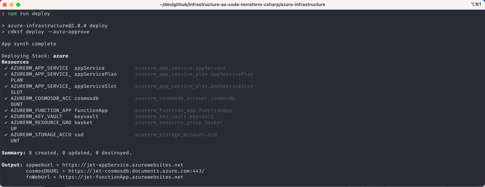
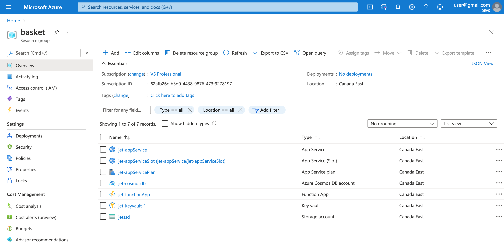
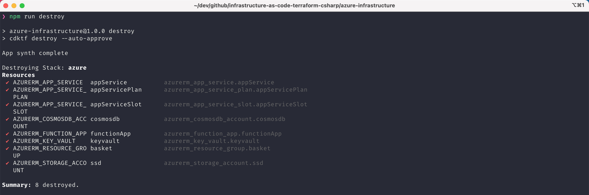

## System Requirements

```bash
❯ cdktf --version
0.2.0

❯ dotnet --list-sdks
3.1.x

❯ node --version
v14.x.x

# using Azure terraform provider
❯ az version
{
  "azure-cli": "2.20.0",
  "azure-cli-core": "2.20.0",
  "azure-cli-telemetry": "1.0.6",
  "extensions": {}
}
```

## Getting started

- `az login` (if you haven't already)
- Review and update `Main.cs` file
- `npm run postinstall`
- `npm run deploy`
  
  
- `npm run destroy`
  

Other Useful commands

- `dotnet build`: Builds your dotnet packages
- `cdktf synth`: Synthesize Terraform resources to cdktf.out/
- `cdktf diff`: Perform a diff (terraform plan) for the given stack
- `cdktf deploy`: Deploy the given stack
- `cdktf destroy`: Destroy the given stack

## Terraform Providers

All Terraform providers are available at [registry.terraform.io](https://registry.terraform.io/).
Learn more about using modules and providers https://cdk.tf/modules-and-providers
